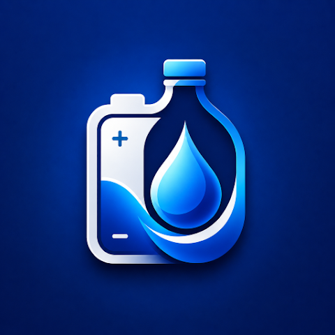
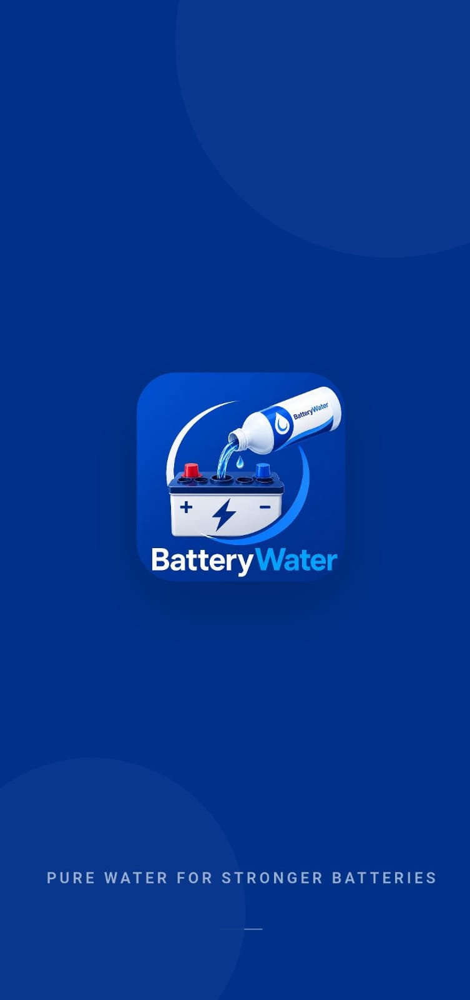
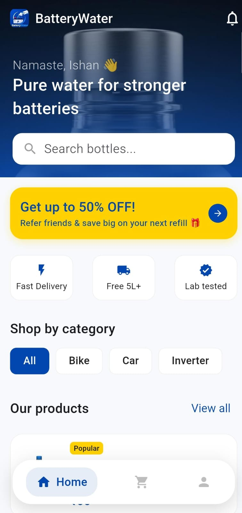
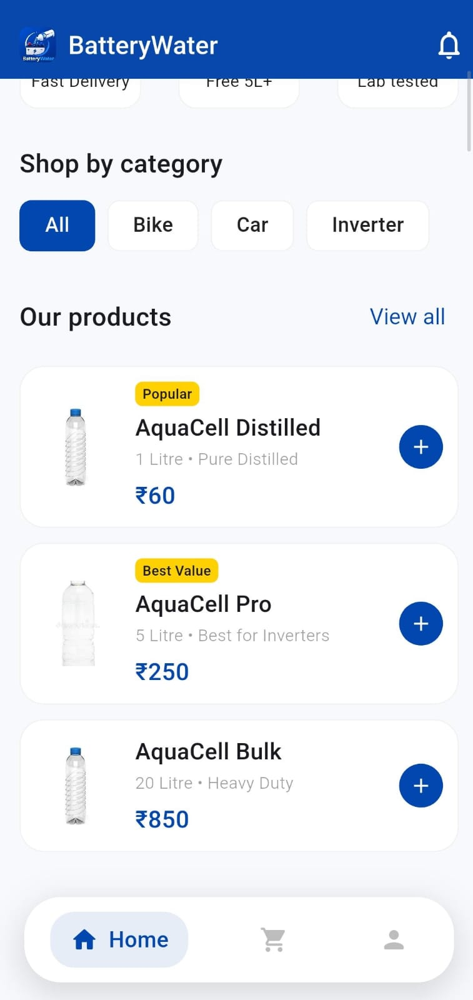
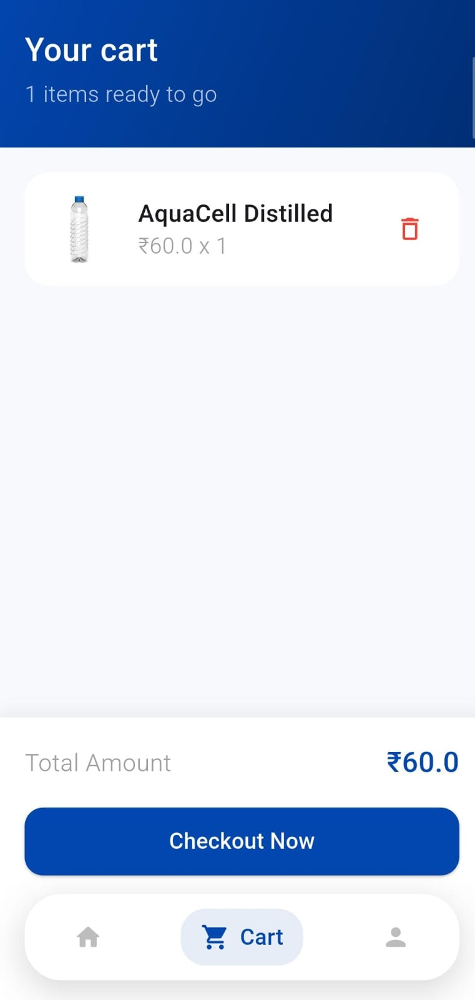
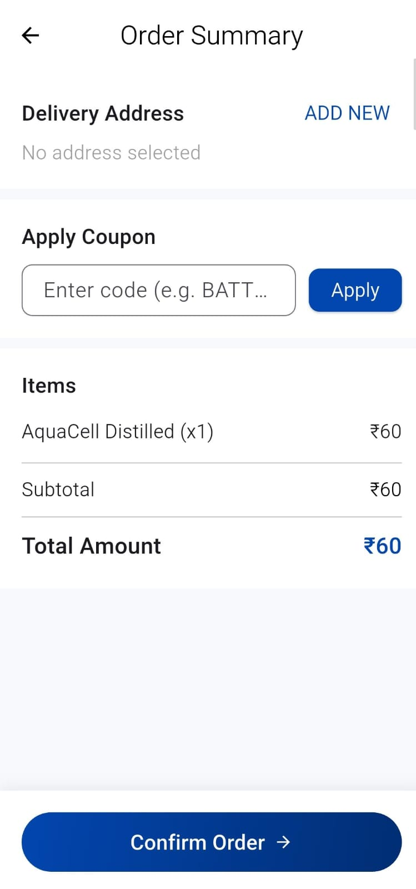
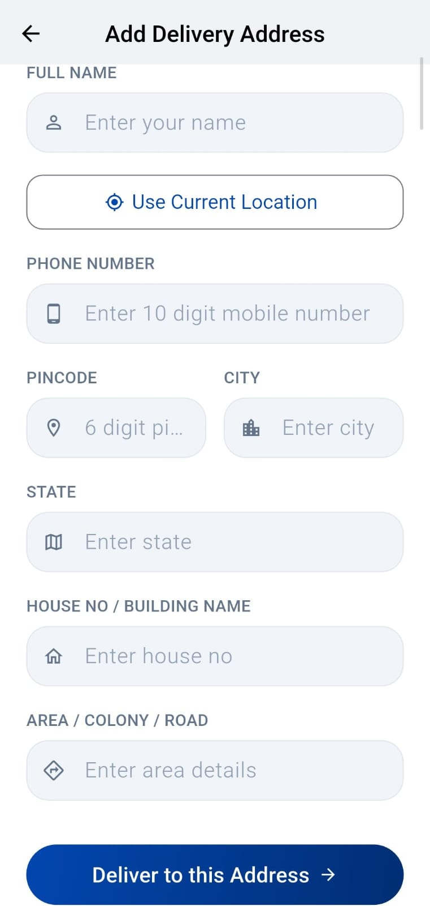

# 💧 Battery Water

  

<h3 align="center">Pure Water for Stronger Batteries 🔋💧</h3>

  A modern Android application for ordering premium distilled battery water
  for cars, bikes, inverters, UPS systems, trucks, solar systems and more.

---

## 📱 About Battery Water

**Battery Water** is a modern mobile application developed by **Walia Creations** that makes purchasing high-quality distilled battery water simple, fast, and convenient.

The application is designed for individuals, vehicle owners, workshops, garages, and businesses that need reliable battery water for maintaining battery performance.

With Battery Water, users can easily browse products, search for battery water, manage their cart, place orders, and keep track of their purchases — all from one simple and user-friendly application.

---

## 🚀 Available on Google Play

**Battery Water is officially available on the Google Play Store.**

> 💧 **Battery Water – Pure Water for Stronger Batteries**

Search for **Battery Water – Walia Creations** on Google Play and install the app on your Android device.

---

## ✨ Features

### 🛒 Shopping

- Browse premium distilled battery water products
- View product information and pricing
- Add products to cart instantly
- Manage product quantities
- Simple and convenient checkout experience

### 🔍 Product Discovery

- Quick product search
- Category-based browsing
- Clean product cards
- Easy navigation between products

### 👤 User Account

- Secure sign-in
- User profile management
- Delivery address management
- Phone number management
- View previous orders

### 📦 Orders

- Simple online ordering
- Order history
- Order tracking
- Convenient doorstep delivery experience

### 🎨 User Experience

- Modern mobile interface
- Clean and responsive design
- Fast navigation
- Simple shopping workflow
- Battery Water themed UI

---

## 🔋 Perfect For

Battery Water can be used for distilled water requirements in:

- 🚗 Cars
- 🏍️ Bikes
- 🔋 Inverters
- ⚡ UPS Systems
- 🚚 Trucks
- ☀️ Solar Battery Systems
- 🏭 Industrial Batteries
- 🔧 Workshops & Garages

---

## 📸 App Screenshots

  
  
  

  
  
  

  

---

## 💙 Why Battery Water?

Battery Water is designed to make purchasing distilled battery water easier and more convenient.

Whether you need battery water for your **car, bike, inverter, UPS, truck, solar battery system, or workshop**, the app provides a simple way to discover products and place orders from your mobile device.

Our focus is on:

- 💧 Quality battery water products
- ⚡ Simple and fast ordering
- 📦 Convenient doorstep delivery
- 🔒 Secure shopping experience
- 📱 Clean and easy-to-use mobile interface
- 🔋 Better battery maintenance

---

## Where can I download the app?

Battery Water is available for Android through Google Play.

## What types of batteries can distilled water be used with?

Distilled water is commonly used with compatible lead-acid batteries. Always follow the instructions provided by your battery manufacturer.

## 🏢 Walia Creations

**Battery Water** is developed and published by **Walia Creations**.

Our goal is to build simple, useful, and modern digital solutions that solve real-world problems.

---

## ⚠️ Disclaimer

Battery Water is intended to provide a convenient platform for purchasing distilled battery water.

Always follow your battery manufacturer's maintenance instructions and recommended water levels. Battery requirements may vary depending on battery type and manufacturer.

---

  <b>💧 Battery Water</b>

  <b>Pure Water • Stronger Batteries • Better Performance 🔋</b>

  Made with ❤️ by <b>Walia Creations</b>

